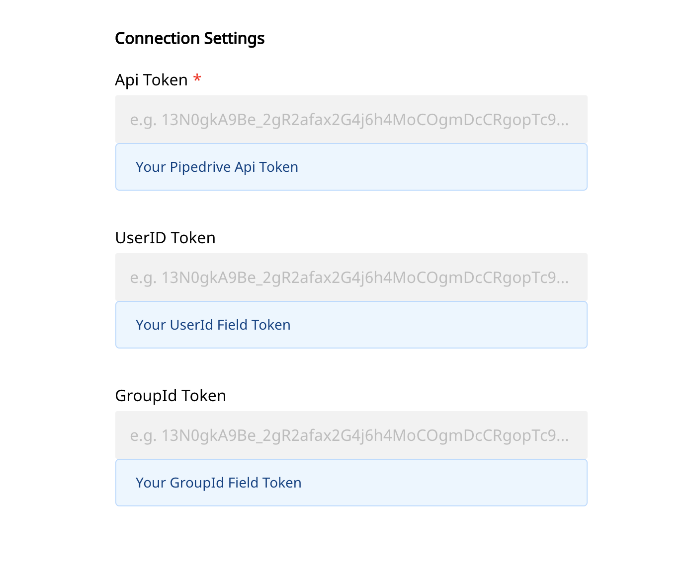

# Pipedrive

[Pipedrive](https://www.pipedrive.com/) is a CRM platform made for salespeople, by salespeople. It provides its users with solutions that are  designed to help SMBs efficiently manage the sales process and grow their business.

You can now send your event data directly to Pipedrive through RudderStack.


**Find the open-source transformer code for this destination in our** [**GitHub repo**](https://github.com/rudderlabs/rudder-transformer/tree/dest-pipedrive)**.**


## Getting Started

Before configuring your source and destination on the RudderStack, please check whether the platform you are sending the events from is supported. Please refer the following table to do so:

| **Connection Mode** | **Web** | **Mobile** | **Server** |
| :--- | :--- | :--- | :--- |
| Device mode | -| -| - |
| **Cloud mode** | **Supported** | **Supported** | **Supported** |


To know more about the difference between Cloud mode and Device mode in RudderStack, read the [RudderStack connection modes](https://docs.rudderstack.com/get-started/rudderstack-connection-modes) guide.


Once you have confirmed that the platform supports sending events to CleverTap, perform the steps below:

* From your [RudderStack dashboard](https://app.rudderstack.com/), add the source and Pipedrive as a destination.


Please follow our guide on [How to Add a Source and Destination in RudderStack](https://docs.rudderstack.com/how-to-guides/adding-source-and-destination-rudderstack) to add a source and destination in RudderStack.




## Connection Settings

To successfully configure Pipedrive as a destination, you will need to configure the following settings:

* **Api Token:** Your api token is a unique token generated for your account. It can be found in your account in the **Company Settings**-->**Personal Preferances** --> **API**.


`GroupId Token` and `UserId Token` fields are related to Custom Field tokens in Pipedrive.


**Note:** Pipedrive does not support mapping userId or groupId. Instead they create id's internally. So, in order for rudderstack calls to work with Pipedrive, user needs to create custom fields for userId, groupId in Pipedrive to which the provided userId and groupId values would be mapped to.

 **Note:** `GroupId Token` and `UserId Token` are required only if calls like identify, group, etc. will be made. In that case, rudderstack needs a way to map provided userId's and groupId's in the destination.

## Using Custom Fields

**Custom fields** can be created in Pipedrive. User can pass values for created custom fields in rudderstack payload. The mapping, however needs to be configured in the Rudderstack Dashboard.

In order to create custom fields and provide the mappings in Rudderstack, please follow the steps below.

* To create Custom fields go to **CompanySettings** --> **Data Fields** --> **Add Custom Field**.
* Create new Field under the desired section (Leads/Person/Organization/Product).


* Next provide the Custom field name and the token under the respective section in the Rudderstack dashboard as seen in the image below.


**Note:**  Field names are case sensitive.

* For `userId` and `groupId` tokens, create a Custom Field under Persons and Organizations respectively.
* In the dashboard, just provide the Tokens. The actual field name can be anything and is not required by Rudderstack.
* For all other cases, provide both the exact Field name and token in the dashboard.

## Supported Events

The following events are supported by Rudderstack for Pipedrive destionation.

* Identify
* Alias
* Group
* Track

The following Ecommerce events are also supported:

* Product Viewed
* Order Completed


**More details on the Ecommerce events can be found in the Rudderstack* [**Ecommerce Events Specification**](https://docs.rudderstack.com/rudderstack-api-spec/rudderstack-ecommerce-events-specification/ordering)**.**


### Identify

This method allows you to link the users and their actions to a specific userid. You can also add additional information as traits to a user. Once you set the identify information to the user, those will be passed to the successive track or page calls. To reset the user identification, you can use the reset method.

The identify() method definition is as follows:

``` 
rudderanalytics.identify([userid], [traits], [options], [callback]);
```


For an identify call, a `Person` object is create in Pipedrive.


Sample identify call:

```
rudderanalytics.identify(
"sample-user-id",
{
  "name": "John Doe",
  "email": "john@doe.com"
});
```

Fields that can be passed in identify method are as follows:

* name
* email
* phone
* visible_to
* add_time

Custom Fields can also be passed in the method. However, provide the field name and token in Rudderstack dashboard under `Persons` section. Otherwise, random-key value pairs are dropped.

**Note:** For identify, userId token is required. Please refer to the Connection settings section for more details.

Example of identify method with Custom Fields:
```
rudderanalytics.identify(
"sample-user-id",
{
  "name": "John Doe",
  "email": "john@doe.com",
  "role": "Software Developer"
});
```
The `role` field and corresponding Pipedrive api key is provided in Rudderstack dashboard.

### Alias

Alias method is used to merge to users.

Sample alias call
```
rudderanalytics.alias("to", "from", options, callback);
```

**Note:** Both the user id's in alias should be valid, i.e both the users should be already existing Pipedrive `Persons`.
